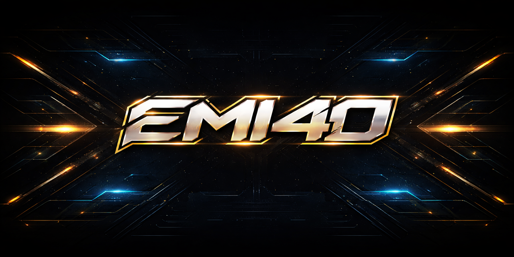

# 👋 Hey, soy Emilio

🎛️ Ingeniero de iluminación
💻 Usuario de Arch Linux + Hyprland
⚡ Diseñando shows en QLC+
🔥 Creando identidad como DJ EMIX

---

## 🚀 Sobre mí

Me gusta combinar tecnología con iluminación y música.
Trabajo creando shows, efectos y setups personalizados.

---

## 🛠️ Tecnologías / Tools

- 🐧 Arch Linux + Hyprland
- 💡 QLC+
- 🎛️ VirtualDJ
- 🎨 Diseño / Branding
  
---

## ⚡ Proyectos

* 💡 Shows de iluminación (QLC+)
* ⚙️ Configuración de Hyprland
* 🎨 Branding DJ EMIX

---

## 📌 Actualmente

Mejorando mis shows y aprendiendo más sobre sistemas y automatización.

---

## 🔥 Meta

Llevar mis shows a nivel profesional y crear setups únicos en eventos.
